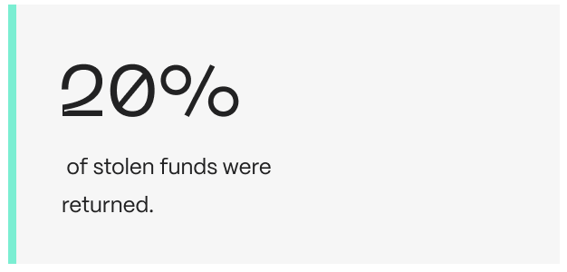

---
tags:
  - SEAL/Initiative
  - Protocol
  - DAO
---

# Safe Harbor for Protocols

## Why You Should Care

Currently, the process for fund recovery during an [active exploit](./key-terms.md#active-exploit) is a Wild West. There are no standards or protections for ethical Whitehats hoping to help prevent the next hack. Those who intervene do so without any legal protection or assurance of reward.

As of 2023, just 20% of stolen assets are recovered. With Safe Harbor we aim to approach 100%.

|                       |
| :-----------------------------------------------------------------------------: |
| Hacken 2023 [Security Report](https://hacken.io/insights/2023-security-report/) |

Safe Harbor defines clear guidelines for what a Whitehat can and cannot do to protect your protocol, as well as what happens after protection occurs.

1. **A higher chance of fund recovery:** In the event of an attack on your protocol, whitehats will be more likely to step in and your funds are more likely to be returned.
2. **Guide of how Whitehats operate**: When adopting Safe Harbor, you can define certain adoption details. These details specify bounty terms for successful Whitehats, what assets should be protected, where recovered funds should be returned ([asset recovery address](./key-terms.md#asset-recovery-address)), and KYC requirements prospective Whitehats must follow.
3. **Systematic & Financial Premonition**: Safe Harbor helps answer the question “what next” after a hack targeting your protocol. The agreement specifies how Whitehats should return your funds and the maximum bounty they can receive, letting you better plan ahead.

## Protocol Adoption

Safe Harbor adoption is easier than setting up a Bug Bounty. You can either do so manually, following SEAL’s [adoption checklist](https://docs.google.com/document/d/1ZfpJacBKGZR1EcfxReqSToXXSHF-iOIThU66S6M20aQ), or you can use the tools provided by third parties like Skylock or [Immunefi](https://immunefisupport.zendesk.com/hc/en-us/articles/26356475239313-Safe-Harbor-Overview-for-Projects).

Safe Harbor was written explicitly with DAOs in mind. They can adopt safe harbor using their decentralized governance measures.

To get started, we recommend:

1. If you already use Immunefi for bug bounties, sign up using their adoption portal.
2. Otherwise, contact Dickson at “*dickson@skylock.xyz*” who can help kickstart your adoption.

Adoption will generally follow the following process:

1. Decide on Adoption Details:

   - **On-Chain Assets**: List all smart contract and wallet addresses to protect.
   - **[Asset Recovery Address](./key-terms.md#asset-recovery-address)**: Provide an address for Whitehats to return recovered funds.
   - **Bounty Terms**: Set bounty percentage and cap for successful Whitehats (recommended 10% and $1M USD, respectively).
   - **KYC Requirements**: Define Know Your Customer (KYC) requirements for Whitehats.
   - **Emergency Contact Information**: Provide contact details for use during an exploit.

2. Adoption Process:
   - **Create Agreement Fact Pages**: Detail your adoption specifics.
   - **DAO Procedures**: For DAOs, follow standard procedures to push through adoption.
   - **Public Disclosure**: Publish adoption details in accessible locations such as the Safe Harbor Registry and your website’s Terms and Conditions.
   - **Maintain Adoption**: Ensure adoption details are updated whenever a new asset is deployed on-chain.

Collecting all this information ensures that, in the event of an attack against your protocol, whitehats have the knowledge and permission required to step in and minimize losses.

## After You’ve Adopted

Once you've adopted Safe Harbor, maintaining it is crucial for ongoing protection of any new assets. If you publish a new asset always ensure you update your safe harbor adoption so everything remains protected.

If you want to make any changes to your adoption details, for example adjusting the bounty terms or KYC requirements, you must do so before an exploit occurs. Protocols are not permitted to retroactively change their adoptions details after an exploit.

## In the Event of a Hack

In the event of an exploit you’ll follow the below process.

1. **Asset Recovery**: Whitehats will use your designated Asset Recovery Address to return any recovered funds and attempt to contact your designated emergency contact. In general this should happen within 6 hours of the event, though it may take as long as 48 hours.
   <<<<<<< HEAD
2. # **Post-recovery Procedure**: Upon receiving your recovered assets, conduct any required KYC checks using the disclosed KYC provider. Then, distribute the agreed bounty to the Whitehat according to the bounty terms specified in your adoption details.
3. **Post-recovery Procedure**: Upon receiving your recovered assets, conduct any required KYC checks using the disclosed KYC provider. Then, distribute the agreed bounty to the Whitehat according to the bounty terms specified in your adoption details.
   > > > > > > > develop
